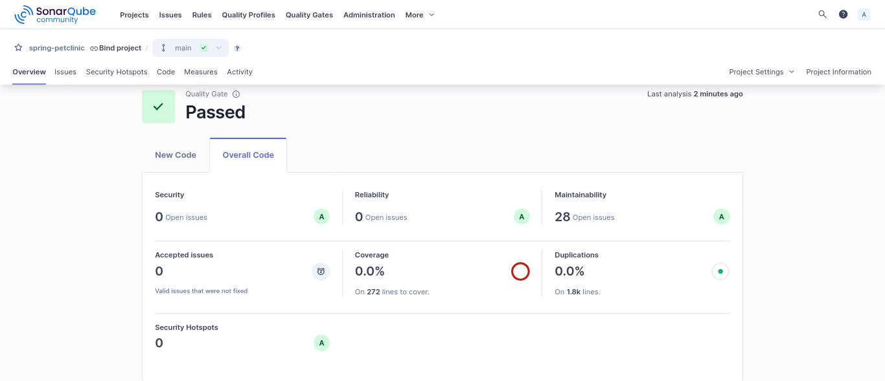

# Spring Petclinic Docker Deployment

This repository provides **Docker Compose configurations** for deploying the Spring Petclinic application with multiple database backends, monitoring, and reverse proxy support. It also includes Gradle/Maven build artifacts, database scripts, and monitoring dashboards.

## **Overview**

This repository supports multiple deployment setups for the Spring Petclinic application:

* **Development environment with MySQL** backend.
* **Production environment with PostgreSQL** backend.
* **Full monitoring stack** including Prometheus, Grafana, and exporters.
* **Reverse proxy with Nginx and SSL termination**.
* Uses **Docker secrets** for database credentials.
* Includes **Gradle/Maven builds** for generating the executable JAR.

---

## **Project Structure**

```
.
├── compose.dev.yml          # MySQL + app (dev profile)
├── compose.prod.yml         # Postgres + app (prod profile)
├── compose.yml              # Spring app + Nginx + monitoring
├── Dockerfile               # Dockerfile for Spring Petclinic
├── docker-entrypoint.sh     # Entrypoint script
├── certs/                   # SSL certificates for Nginx
├── configs/                 # Additional config files
├── monitoring/              # Prometheus, Grafana, and alertmanager configs
├── secrets/                 # DB passwords (used as Docker secrets)
├── src/                     # Java source code
├── build/                   # Gradle build artifacts
├── target/                  # Maven/Gradle build outputs
├── k8s/                     # Kubernetes deployment manifests
├── .env                     # Environment variables for Compose
└── README.md
```

* `src/main/java` → Application source code.
* `src/main/resources` → Application properties, database scripts, messages, templates, static assets.
* `build/` & `target/` → Compiled classes and JAR files.
* `monitoring/` → Prometheus, Grafana, and Alertmanager configs.
* `compose*.yml` → Separate Compose files for dev, prod, and monitoring environments.

---

## **Docker Compose Configurations**

### 1. Dev Environment (MySQL)

* **Services:**

  * `app` → Spring Petclinic (dev profile).
  * `mysql` → MySQL database.
  * `mysqld-exporter` → Prometheus MySQL exporter.

* **Features:**

  * Uses Docker secrets for MySQL credentials.
  * Healthchecks ensure MySQL is ready before app startup.
  * Application profile: `SPRING_PROFILES_ACTIVE=dev`.

```bash
docker compose -f compose.dev.yml -f compose.yml --env-file .env.dev --env-file .env up -d --build
```

---

### 2. Prod Environment (Postgres)

* **Services:**

  * `app` → Spring Petclinic (prod profile).
  * `postgres` → PostgreSQL 15 database.
  * `postgres-exporter` → Prometheus PostgreSQL exporter.

* **Features:**

  * Docker secrets for Postgres credentials.
  * Healthchecks using `pg_isready`.
  * Application profile: `SPRING_PROFILES_ACTIVE=prod`.
  * Persistent volume for database data.

```bash
docker compose -f compose.prod.yml -f compose.yml --env-file .env.prod --env-file .env up -d --build
```

---

### 3. Monitoring & Reverse Proxy Stack

* **Services:**

  * `app` → Spring Petclinic container.
  * `nginx` → Reverse proxy with SSL termination.
  * `prometheus` → Monitoring server.
  * `alertmanager` → Alerts for Prometheus.
  * `grafana` → Dashboards for metrics.

* **Features:**

  * Healthcheck for app: `/actuator/health`.
  * Nginx mounted with custom SSL certificates.
  * Prometheus and Grafana read metrics from MySQL/Postgres exporters.
  * Separate networks for `frontend` and `backend`.


---

## **Setup Instructions**

1. Clone the repository:

```bash
git clone https://github.com/abdullahhamada7/spring-petclinic-docker.git
cd spring-petclinic-docker
```

2. Create `.env` files with credentials:

```env
APP_PORT=8080
GF_ADMIN_USER=admin
GF_ADMIN_PASSWORD=admin
```
`.env.dev`
```env
MYSQL_DATABASE=petclinic
MYSQL_USER=petclinic
MYSQL_PORT=3306
MYSQL_PASSWORD_FILE=/run/secrets/mysql_password
```

`.env.prod`
```env
POSTGRES_DB=petclinic
POSTGRES_USER=petclinic
POSTGRES_PORT=5432
```

3. Ensure Docker secrets exist:

```bash
secrets/mysql_password.txt
secrets/mysql_root_password.txt
secrets/postgres_password.txt
secrets/postgres_root_password.txt
```
---

## **Environment Variables & Secrets**

* Use `.env` with `.env.dev` or `.env.prod` for non-sensitive configuration.
* Sensitive credentials stored as Docker secrets:

  * MySQL: `mysql_password`, `mysql_root_password`
  * Postgres: `postgres_password`, `postgres_root_password`

---

## **Networks & Volumes**

* **Networks:**

  * `backend` → Internal communication between app, DB, and monitoring services.
  * `frontend` → Exposed for Nginx reverse proxy.

* **Volumes:**

  * `mysql_data` → Persistent MySQL storage.
  * `postgres_data` → Persistent Postgres storage.

----

# SonarQube
```bash 
export SONAR_TOKEN=<your_token>
./gradlew clean test jacocoTestReport sonarqube
```


 